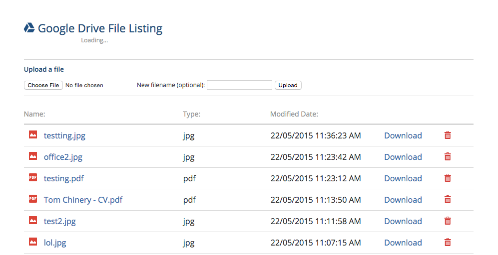

## Synopsis

An angular app that uses Google Drive to view a users files, upload new files or
delete existing ones.

Login via oAuth2.

You can find the app running [here.](http://tomchinery.com/rtds/)

## Installation

Presuming NodeJS is installed clone the repository to your desired location and run:

```
    npm install
```

Ensure index.html is being served up by your web server.

To setup OAuth with
Google Drive on your web server you will have to setup a new project in the [Google Console](https://code.google.com/apis/console) to allow access to user data.
Ensure you have enabled the Google Drive API
and that you have filled in the correct credentials for the project. Your redirect
url should be same as your base url.

Edit line 7 of index.html with the correct base url:
```
  <base href="http://example.com" target="_blank">
```

Finally update the auth_url method with your client_id and redirect url in
app/services/OAuthService.js:
```
  function authURL() {
    var clientID = "YOURCLIENTID";
    var driveScope = "https://www.googleapis.com/auth/drive";
    var redirectURL = "YOURREDIRECTURL";
    var responseType = "token";

    var url =
    "https://accounts.google.com/o/oauth2/auth?scope=" + driveScope +
    "&client_id=" + clientID + "&response_type=" + responseType +
    "&redirect_uri=" + redirectURL;

    window.location.replace(url);
  }
```

## Tests

The test suite is written with Karma and Jasmine. To run the test server run:

```
  karma start karma.conf.js
```

and to run the test suite:

```
  karma run karma.conf.js
```

## Dependencies

angular: "~1.3.15"

angular-mocks: "~1.3.15"

angular-route: "~1.3.15"

angular-animate: "~1.3.15"

angular-spinkit: "~0.3.3"

angular-cookies: "~1.3.15"

angular-loading-bar: "~0.7.1"

## Todo

Improve test suite to cover whole application.
